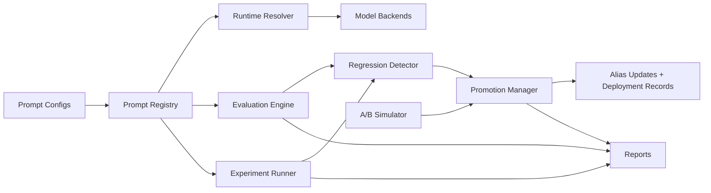
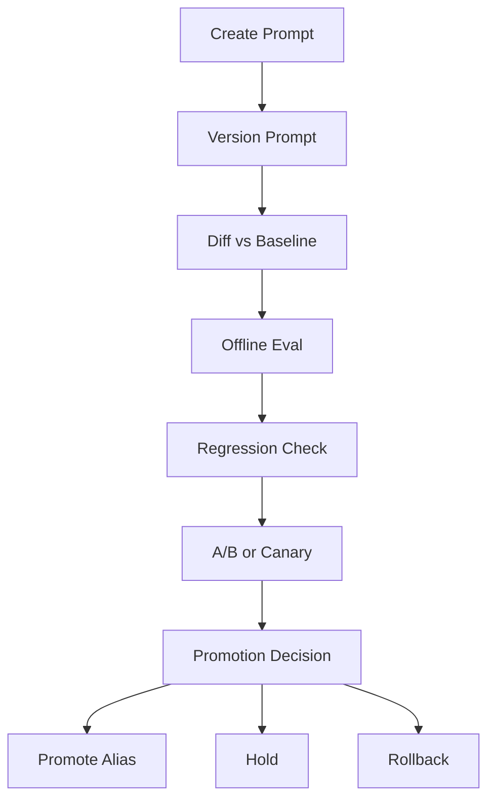

# Prompt Lifecycle & Experimentation Platform

Production-style Python platform for versioned prompt management, evaluation, experimentation, promotion, rollback, and auditability. It runs in deterministic demo mode out of the box and supports real model backends through a provider abstraction.

## Why Prompt Lifecycle Management Matters

Prompt changes alter product behavior. If those changes are edited ad hoc, teams lose reproducibility, auditability, and safe rollback. This repository treats prompts like deployable software artifacts:

- immutable prompt versions
- mutable aliases such as `development`, `staging`, `production`, `latest`
- offline evaluation before promotion
- regression gates
- simulated online A/B experiments
- deployment history and rollback
- report generation and audit trails

## Architecture Overview





## Prompt Registry Concepts

Every prompt definition includes template text, variables, task type, default model configuration, and governance metadata. Each stored version is immutable. Aliases are mutable pointers, which enables safe promotion and rollback.

Questions the platform answers:

- what changed in this prompt?
- which version is in production?
- which experiments used this version?
- what eval results justified promotion?
- what should be rolled back if regression occurs?

## Features

- Prompt registry with immutable versions and alias management
- Prompt diffing and rollback
- Environment-aware runtime prompt resolution with snapshot fallback
- Offline evaluation on JSONL, CSV, and YAML datasets
- Built-in metrics: exact match, token F1, BLEU-like overlap, ROUGE-L-like overlap, rubric score
- Experiment runner for multi-variant comparisons
- Regression detector for quality, latency, token, cost, and structure gates
- A/B simulation with sticky assignments and online metric summaries
- Promotion workflow with policy gating and deployment records
- JSON, CSV, Markdown, and HTML reporting
- Deterministic demo mode plus real backend stub
- Pytest suite, Docker support, and GitHub Actions CI

## Repository Walkthrough

- `src/prompt_platform/registry.py`: versioning, aliases, diffs, rollback
- `src/prompt_platform/runtime.py`: retrieval, rendering, snapshot fallback
- `src/prompt_platform/evaluation.py`: dataset loading and evaluators
- `src/prompt_platform/experiments.py`: tournaments and leaderboards
- `src/prompt_platform/regression.py`: regression thresholds and gating
- `src/prompt_platform/abtesting.py`: online experiment simulation
- `src/prompt_platform/promotion.py`: promotion and rollback management
- `src/prompt_platform/reports.py`: JSON, CSV, Markdown, HTML outputs
- `src/prompt_platform/cli.py`: complete CLI
- `configs/`: prompts, experiments, environments, thresholds, pricing, policies
- `data/golden/`: sample golden datasets
- `tests/`: unit and workflow tests

## Installation

### Prerequisites

- Python 3.11+
- `pip`
- optional: Docker

### Local Setup

```bash
python -m venv .venv
. .venv/Scripts/activate
python -m pip install --upgrade pip
pip install -e .[dev]
```

or:

```bash
make install
```

## Quickstart

Run the deterministic end-to-end demo:

```bash
make demo
```

That seeds the registry, evaluates baseline and candidate prompts, runs a tournament experiment, simulates an A/B test, applies promotion decision logic, and emits reports to `artifacts/generated/demo`.

## Step-by-Step Walkthrough

### Step 1: Clone repo

```bash
git clone <your-repo-url>
cd prompt-lifecycle-platform
```

### Step 2: Create virtual environment

```bash
python -m venv .venv
. .venv/Scripts/activate
```

### Step 3: Install dependencies

```bash
make install
```

### Step 4: Create your first prompt

```bash
python -m prompt_platform.cli registry create --name support_classifier --file configs/prompts/support_classifier_v1.yaml
```

### Step 5: Create a new prompt version

```bash
python -m prompt_platform.cli registry version --name support_classifier --file configs/prompts/support_classifier_v2.yaml
```

### Step 6: Diff two versions

```bash
python -m prompt_platform.cli registry diff --name support_classifier --from-version 1 --to-version 2
```

### Step 7: Run an offline eval

```bash
python -m prompt_platform.cli eval run --prompt support_classifier@candidate --dataset data/golden/support_classifier.jsonl
```

### Step 8: Run a regression check

```bash
python -m prompt_platform.cli regress check --baseline artifacts/generated/demo/evaluations/support_classifier_baseline.json --candidate artifacts/generated/demo/evaluations/support_classifier_candidate.json --threshold-config configs/thresholds/default.yaml
```

### Step 9: Simulate an A/B test

```bash
python -m prompt_platform.cli abtest simulate --config configs/experiments/support_classifier_ab.yaml
```

### Step 10: Promote a candidate prompt

```bash
python -m prompt_platform.cli promote --name support_classifier --from-version 2 --alias production
```

### Step 11: Roll back to a prior version

```bash
python -m prompt_platform.cli rollback --name support_classifier --alias production --to-version 1
```

### Step 12: Generate a decision report

```bash
python -m prompt_platform.cli report --input artifacts/generated/demo/summary.json --format html
```

## README Command Examples

```bash
make install
make test
make demo
python -m prompt_platform.cli registry create --name support_classifier --file configs/prompts/support_classifier_v1.yaml
python -m prompt_platform.cli registry version --name support_classifier --file configs/prompts/support_classifier_v2.yaml
python -m prompt_platform.cli registry diff --name support_classifier --from-version 1 --to-version 2
python -m prompt_platform.cli eval run --prompt support_classifier@staging --dataset data/golden/support_classifier.jsonl
python -m prompt_platform.cli regress check --baseline artifacts/baseline_eval.json --candidate artifacts/candidate_eval.json
python -m prompt_platform.cli abtest simulate --config configs/experiments/support_classifier_ab.yaml
python -m prompt_platform.cli promote --name support_classifier --from-version 2 --alias production
python -m prompt_platform.cli rollback --name support_classifier --alias production --to-version 1
python -m prompt_platform.cli report --input artifacts/latest_run.json --format html
```

## Configuration Guide

Environment profiles in `configs/environments/` define:

- storage path
- SQLite metadata path
- mode: `mock` or `real`
- backend configurations

Thresholds in `configs/thresholds/` define regression gates. Promotion policies in `configs/policies/` define allowlists and gating behavior. Pricing profiles are versioned separately in `configs/pricing/`.

## Sample Prompts and Datasets

Included examples:

- customer support classification
- executive summarization

The repository structure supports adding extraction, document QA, and structured JSON generation prompts using the same artifact model.

## Adding a New Prompt

1. Add a YAML prompt under `configs/prompts/`
2. Register it with `registry create`
3. Add a golden dataset under `data/golden/`
4. Run `eval run`
5. Add experiment configs under `configs/experiments/`

## Adding a New Evaluator

Pass a hook into `EvaluationEngine(..., evaluator_hooks={"my_metric": my_fn})` and include the metric in your evaluation or experiment config.

## Adding a New Experiment Type

Extend `ExperimentRunner` with another config loader and ranking strategy. The existing abstractions already separate prompt variant identity, backend selection, dataset selection, metrics, and leaderboard output.

## Interpreting Reports

- `accuracy` and `pass_rate` capture baseline quality
- `latency_ms`, `tokens_in`, and `total_cost` capture operational tradeoffs
- `structured_validity` shows schema compliance proxy
- promotion memos combine baseline vs candidate metrics, regression results, and optional A/B evidence

## Governance and Auditability

- immutable version records
- alias reassignment audit trail
- deployment records
- created-by and approved-by metadata
- deprecation and archival flags
- production allowlist for controlled promotion

## Troubleshooting

- If `registry diff` fails, confirm both versions were registered into the same profile storage.
- If real mode fails, confirm the configured API key environment variable is set.
- If output files are missing, verify the selected profile’s artifact root and output paths.

## FAQ

**Does this support real model providers?**  
Yes. The project ships with a mock backend and an OpenAI-compatible client stub.

**Is demo mode deterministic?**  
Yes. Mock outputs and A/B simulation are deterministic.

**Can prompts be resolved offline?**  
Yes. The runtime resolver supports snapshot fallback.

## Limitations

- The real backend path is a generic OpenAI-compatible HTTP client, not a full vendor SDK integration.
- Semantic similarity is optional and not bundled by default.
- HTML reporting is static artifact generation, not a live dashboard service.

## Future Enhancements

- live dashboard service
- semantic similarity plugins
- lineage graph visualization
- notebook-based exploration
- richer registry backends beyond SQLite
- human review workflow integration

## Docker

```bash
docker compose up --build
```

The container runs the deterministic demo and writes artifacts to the mounted `artifacts/` directory.

## CI/CD

GitHub Actions installs dependencies, runs lint and tests, executes a smoke demo, performs a regression check, and uploads demo artifacts.

## How to Run

```bash
make install
make demo
make test
```
